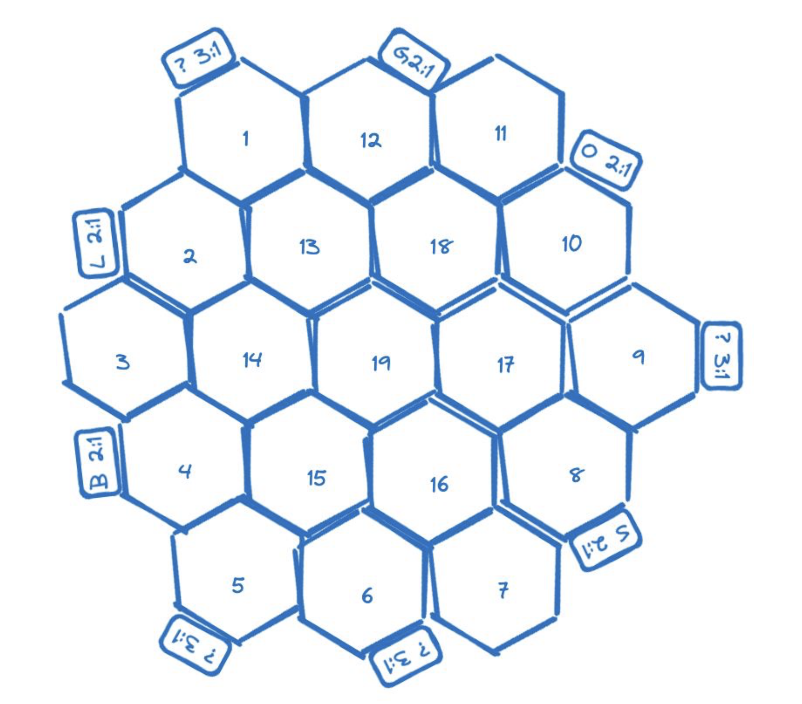
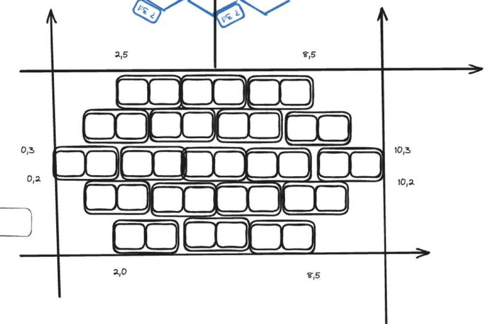

# Dojo Catan

### setup

- Random setup : We distribute resources randomly on the board ( total 19 hex )
  - 3 Hills -> Bricks (19)
  - 4 Forests -> Lumber (19)
  - 3 Mountains -> Ore (19)
  - 4 Fields -> Grains (19)
  - 4 Pasture -> Wools (19)
  - 1 Desert -> X ( starting point )
- Random Number placement : Also distribute by opose circle
- Also random setup determine the player turn
  - 5,2, 6, 3, 8, 10, 9, 12 , 11, 4, 8, 10, 9, 4, 5, 6, 3, 11
- Seaport : will just fix ( anyway resource will be randomize - doesn't matter much )
- development card :
  - Red: knight
  - Yello: victory point
  - Green: progress
- Bonus Point :
  - longest road
  - largest army
- Dice implementation : base on the percentage, we get latest block hash for every round.
  - 2 & 12 = 3 %
  - 3 & 11 = 6 %
  - 4 & 10 = 8 %
  - 5 & 9 = 11 %
  - 6 & 8 = 14 %
  - 7 = 17 %

### Model

- Game : This will hold the overall game state and logic
- Hexagon : This will hold each Hexagon map status like assigned dice index, hexagon id, hand type assigned randomly base on block hash of board generation.

  

- Corner : This will abstract hexagon map into x, y axis map to calculate distance between settlement/road/city. Also it used to place those on the map.
  
- Resource : This will handle each user's resource status. And count points so that can determine is game is end or not.

#### Game

- Order
- Game
- Hexagon

### Action

- Initialize : Setup the board and players with random resources and setup
- End Turn: Give turn to next player and roll the dice and get update
- Upload Auction : Player in current turn can make order
- Accept Auction : Player who got order can accept. and Order complete
- Cancel Auction : Player who made order can cancel before other player accept
- Transfer : Transfer resources from port to player on settlement or city
- Construct : Player can build either road, city or village card if they have required resources
